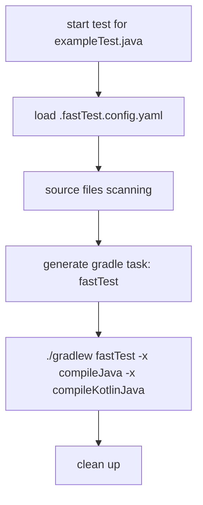

# gradle fast test

Run your unit test with a very fast approach. 

## lifecycles

## roadmap

- [] generate config to enable manually adding source files for a test file
- [] classpath resolver
- [] advanced scanning inside same package
- [] json-schema for config file
