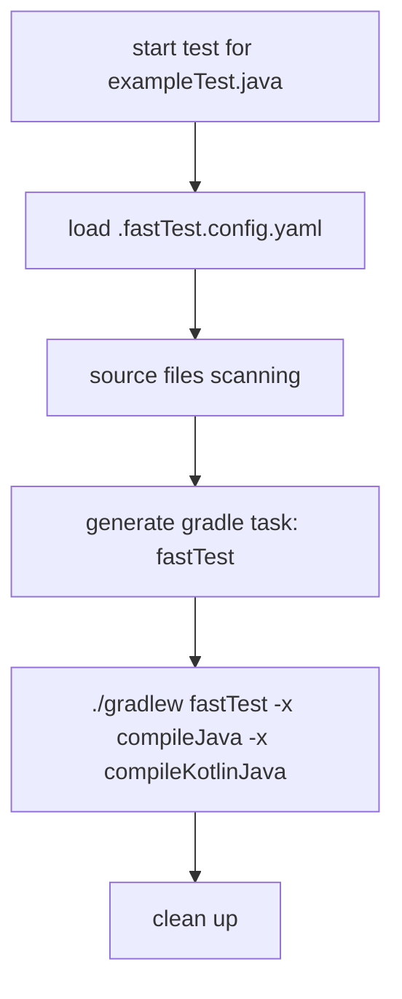

# gradle fast test

Run your unit test with a very fast approach. 

## lifecycles

### source files

1. test file
2. test target file
3. mocked files
4. stubs files

## roadmap

- [] generate config to enable manually adding source files for a test file
- [x] group resolver
- [] classpath resolver
- [] performance: class placeholder
- [] advanced scanning inside same package
- [] json-schema for config file
